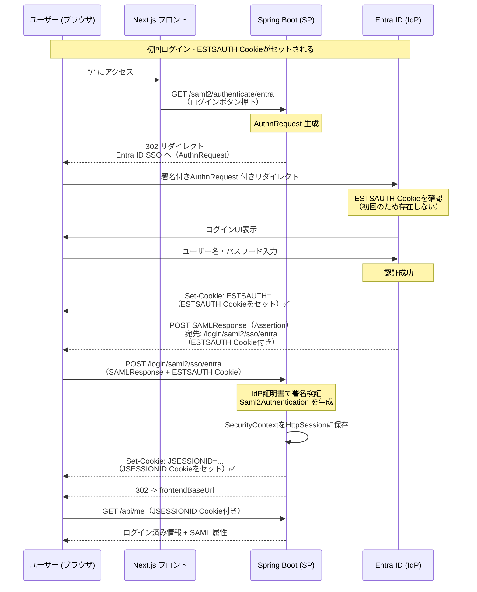
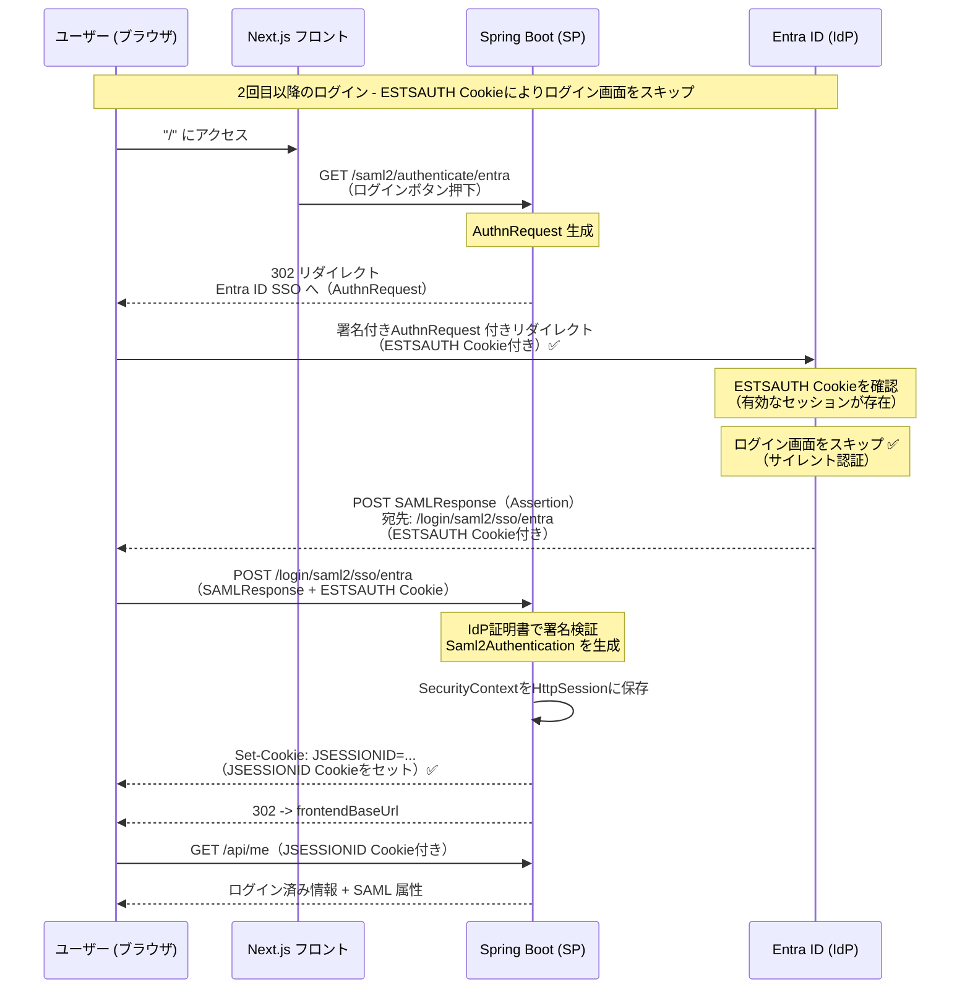
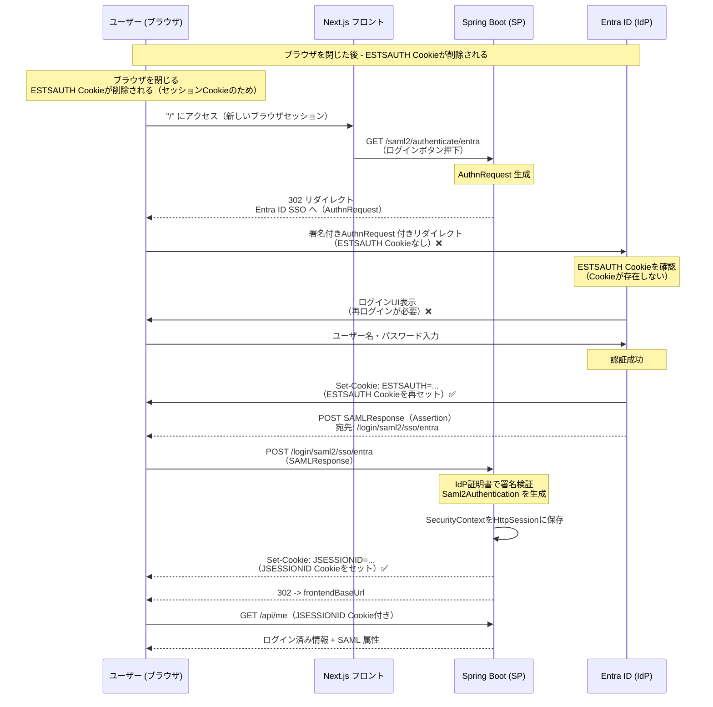
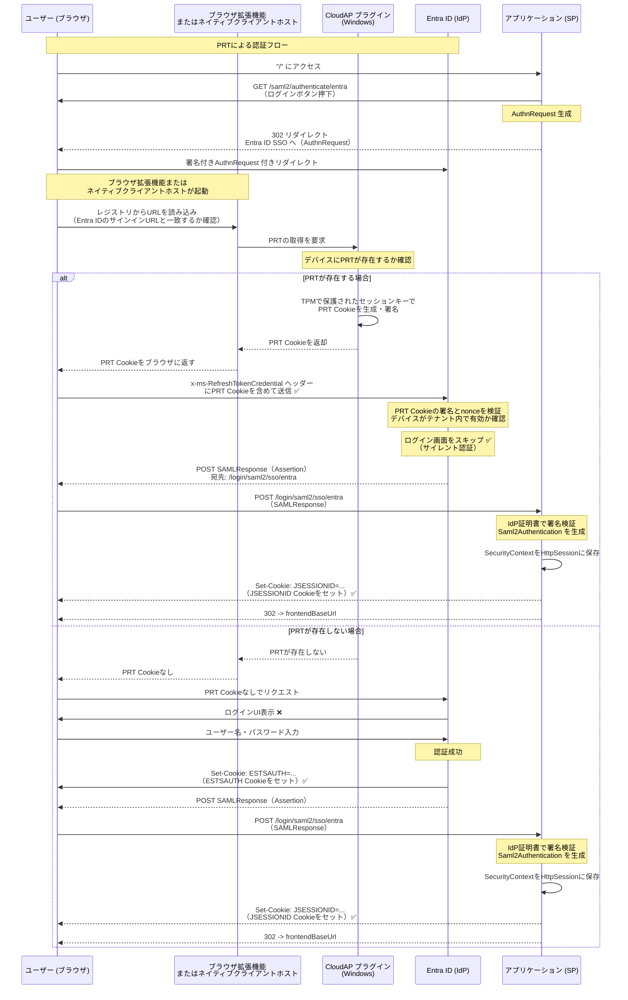

# Entra ID SSO のクッキー、セッション、トークン

Entra ID（旧 Azure AD）を使用したSAML認証における、クッキー、セッション、トークンの仕組みについて説明します。

## 概要

Entra ID SSOでは、複数のクッキーとトークンが異なる役割を果たします：

1. **ESTSAUTH Cookie** - Entra ID側のセッションCookie（M365ログイン状態を保持）
2. **JSESSIONID** - アプリケーション側のセッションCookie（Spring Bootのセッション管理）
3. **PRT（Primary Refresh Token）** - Windows組織ログイン時に使用されるデバイストークン

## 1. ESTSAUTH Cookie（Entra ID側のセッションCookie）

### 概要

`ESTSAUTH` は、Microsoft Entra ID（旧 Azure AD）が設定するセッションCookieです。M365ログイン状態を保持し、ユーザーが既にEntra IDにログインしている場合、再ログインをスキップできます。

### 特徴

- **ドメイン**: `login.microsoftonline.com` または `login.microsoft.com`
- **有効期限**: 通常、ブラウザセッション終了まで（セッションCookie）
- **用途**: Entra ID側の認証状態を保持
- **サイレント認証**: このCookieが存在する場合、Entra IDはログイン画面をスキップして自動的に認証します

### 動作フロー

```
1. ユーザーが初めてEntra IDにログイン
   ↓
2. Entra IDがESTSAUTH Cookieを設定
   ↓
3. 次回、アプリケーションからEntra IDにリダイレクト
   ↓
4. Entra IDがESTSAUTH Cookieを確認
   ├─ Cookieが有効 → ログイン画面をスキップ ✅
   └─ Cookieが無効/存在しない → ログイン画面を表示
   ↓
5. SAMLResponseを生成してアプリケーションに返送
```

### シーケンス図

#### 初回ログイン時のESTSAUTH Cookieセット

初回ログイン時、ユーザーがEntra IDにログインし、ESTSAUTH Cookieがセットされるタイミングを示します。



#### 2回目以降のログイン時（ESTSAUTH CookieによるM365ログインスキップ）

ESTSAUTH Cookieが有効な場合、Entra IDはログイン画面をスキップして自動的に認証します（サイレント認証）。



#### ブラウザを閉じた後の再ログイン（ESTSAUTH Cookieが削除された場合）

ブラウザを閉じると、ESTSAUTH CookieはセッションCookieのため削除されます。次回ブラウザを開いた際は、再ログインが必要になります。



### ブラウザを閉じた時の動作

**通常のブラウザログイン（ESTSAUTH Cookie）**:

```
ブラウザを閉じる → ESTSAUTH Cookieが削除される（セッションCookieのため）
次回ブラウザを開く → M365ログインが必要 ❌
```

**注意**: `ESTSAUTHPERSISTENT` という永続的なCookieが設定される場合もあります。これは、ブラウザを閉じても保持され、次回のログインをスキップできる場合があります。

## 2. JSESSIONID（アプリケーション側のセッションCookie）

### 概要

`JSESSIONID` は、Spring Boot（Spring Security）が設定するセッションCookieです。アプリケーション側の認証状態を保持します。

### 特徴

- **ドメイン**: アプリケーションのドメイン（例: `localhost`）
- **有効期限**: `application.yml` の `server.servlet.session.cookie.max-age` で設定（デフォルト: 1800秒 = 30分）
- **用途**: Spring Securityの認証状態（`SecurityContext`）を保持
- **保存場所**: サーバー側のセッションストレージ（デフォルト: メモリ内の`HttpSession`）

### 設定（application.yml）

```yaml
server:
  servlet:
    session:
      cookie:
        # SAML認証フローではIdPからのPOSTでCookieが必要なため、SameSite=None + Secure=true を推奨
        same-site: ${SESSION_COOKIE_SAME_SITE:none}
        secure: ${SESSION_COOKIE_SECURE:true}
        # SAML認証フローに十分な時間を確保するため、セッション有効期限を延長
        max-age: ${SESSION_COOKIE_MAX_AGE:1800}
      # セッションタイムアウトを延長（SAML認証フローに時間がかかる場合があるため）
      timeout: ${SESSION_TIMEOUT:30m}
```

### セッションCookieの設定項目

| 項目 | 値 | 説明 |
|------|-----|------|
| `same-site` | `none` | クロスサイトリクエストでもCookieを送信（SAML認証フローで必要） |
| `secure` | `true` | HTTPS接続でのみCookieを送信 |
| `max-age` | `1800` | Cookieの有効期限（秒）。30分 = 1800秒 |
| `timeout` | `30m` | サーバー側のセッションタイムアウト（30分） |

### 動作フロー

```
1. ユーザーがSAML認証に成功
   ↓
2. Spring SecurityがSaml2Authenticationを生成
   ↓
3. SecurityContextをHttpSessionに保存
   ↓
4. JSESSIONID Cookieを設定
   ↓
5. 次回のリクエストでJSESSIONID Cookieを送信
   ↓
6. Spring SecurityがHttpSessionからSecurityContextを復元
   ↓
7. 認証済みユーザーとして処理 ✅
```

### セッション管理の実装

Spring Securityでは、`HttpSessionSecurityContextRepository` を使用してセッション管理を行います：

```java
@Bean
public SecurityContextRepository securityContextRepository() {
  return new HttpSessionSecurityContextRepository();
}
```

セッションは `HttpSession` に保存され、`JSESSIONID` Cookieで識別されます。

## 3. PRT（Primary Refresh Token）- Windows組織ログイン

### 概要

PRT（Primary Refresh Token）は、Windowsの組織ログイン（Azure AD Join / Entra ID Join）を使用している場合に使用されるデバイストークンです。

### 特徴

- **保存場所**: Windowsデバイス（TPMなど）に保存
- **有効期限**: デバイスにサインインしている間
- **用途**: デバイスベースのSSO（シングルサインオン）
- **使用条件**: Windows組織ログインを使用している場合

### 動作フロー

```
1. ユーザーがWindowsに組織アカウントでサインイン
   ↓
2. PRTがデバイスに保存される
   ↓
3. アプリケーションで「Entra IDでログイン」をクリック
   ↓
4. ブラウザがEntra IDにリダイレクト
   ↓
5. Entra IDがPRTを確認
   ├─ PRTが有効 → ログイン画面をスキップ ✅
   └─ PRTが無効/存在しない → ログイン画面を表示
   ↓
6. 認証後、SAMLResponseを受け取る
   ↓
7. アプリケーション側のJSESSIONID Cookieを設定
```

### PRTの検出メカニズム

Entra IDは、ブラウザリダイレクト時にPRTの有無を以下のメカニズムで確認します：

#### 1. ブラウザリダイレクト時の処理フロー

ブラウザがEntra IDにリダイレクトする際、以下の処理が自動的に行われます：

```
1. ブラウザがEntra IDのサインインURLにアクセス
   ↓
2. ブラウザ拡張機能またはネイティブクライアントホストが起動
   ↓
3. レジストリから特定のURLを読み込み、Entra IDのサインインURLと一致するか確認
   ↓
4. CloudAPプラグイン（Windows）にPRTの取得を要求
   ↓
5. CloudAPプラグインがデバイスにPRTが存在するか確認
   ├─ PRTが存在する場合
   │  ↓
   │  TPMで保護されたセッションキーでPRT Cookieを生成・署名
   │  ↓
   │  PRT Cookieをブラウザに返す
   │  ↓
   │  ブラウザがx-ms-RefreshTokenCredentialヘッダーにPRT Cookieを含めてEntra IDに送信 ✅
   └─ PRTが存在しない場合
      ↓
      PRT CookieなしでEntra IDにリクエスト
   ↓
6. Entra IDがPRT Cookieの署名とnonceを検証
   ↓
7. デバイスがテナント内で有効か確認
   ├─ 検証成功 → ログイン画面をスキップ ✅
   └─ 検証失敗/PRTなし → ログイン画面を表示
```

#### 2. シーケンス図



#### 3. Microsoft Edgeの組み込み機能

Microsoft Edgeは、拡張機能を使用せずにPRTを検出する機能が組み込まれています：

- **Windows統合認証**: EdgeはWindows Authentication Broker（WAM）を直接利用します
- **自動検出**: デバイスに保存されているPRTに自動的にアクセスします
- **ユーザー体験**: 追加の設定や拡張機能のインストールが不要です

**他のブラウザとの違い**:

| ブラウザ | PRT検出方法 |
|---------|-----------|
| **Microsoft Edge** | 組み込み機能（Windows統合認証）✅ |
| **Google Chrome** | ブラウザ拡張機能が必要（Windows Accounts拡張機能など） |
| **Firefox** | ブラウザ拡張機能が必要 |
| **Safari** | macOSのKeychainを利用（異なるメカニズム） |

#### 4. アプリケーション側での実装

**重要なポイント**: PRTはEntra ID側とWindowsデバイス側で処理されるため、**アプリケーション側で特別な実装は不要**です。

- **標準的なSAML認証フロー**: アプリケーションは標準的なSAML 2.0認証フローを実装するだけで、PRTの恩恵を自動的に受けられます
- **透過的な動作**: PRTが有効な場合も無効な場合も、アプリケーション側は同じSAMLResponseを受け取り、同じように処理します
- **自動的な動作**: Windowsデバイスに組織アカウントでサインインしていれば、PRTの恩恵を自動的に受けられます

**実装例**（現在のプロジェクト）:

```java
// SecurityConfig.java
if (samlEnabled) {
  http.saml2Login(saml2 -> saml2
      .relyingPartyRegistrationRepository(samlRepo)
      .defaultSuccessUrl(frontendBaseUrl, true)
      .failureHandler((request, response, exception) -> {
        log.error("SAML authentication failed", exception);
        response.sendError(HttpServletResponse.SC_FORBIDDEN);
      }));
}
```

この標準的なSAML認証フローにより、PRTが有効な場合、Entra IDが自動的にログイン画面をスキップし、SAMLResponseを返します。

### ブラウザを閉じた時の動作

**Windows組織ログイン（PRT）**:

```
ブラウザを閉じる → PRTは保持される（デバイスに保存されているため）
次回ブラウザを開く → PRTから自動的に認証 → M365ログイン不要 ✅
```

### ESTSAUTH Cookieとの違い

| 項目 | ESTSAUTH Cookie | PRT（Primary Refresh Token） |
|------|----------------|---------------------------|
| **保存場所** | ブラウザのCookieストレージ | Windowsデバイス（TPMなど） |
| **有効期限** | ブラウザセッション終了まで | デバイスにサインインしている間 |
| **ブラウザを閉じた時** | 削除される ❌ | 保持される ✅ |
| **再ログイン** | 必要 ❌ | 不要 ✅ |
| **使用条件** | 通常のブラウザログイン | Windows組織ログイン |

## 4. サイレント認証について

### 概要

「サイレント認証」とは、ユーザーにログイン画面を表示せずに自動的に認証を行う仕組みです。これは特別な実装ではなく、標準的なプロトコル動作です。

### SAML 2.0におけるサイレント認証

SAML 2.0では、IdP（Identity Provider）が既存のセッションを確認し、有効な場合はログイン画面をスキップします：

```
1. SP（Service Provider）がAuthnRequestを送信
   ↓
2. IdP（Entra ID）が既存のセッションを確認
   ├─ セッションが有効 → ログイン画面をスキップ ✅
   └─ セッションが無効/存在しない → ログイン画面を表示
   ↓
3. SAMLResponseを生成してSPに返送
```

### OAuth 2.0 / OpenID Connectとの違い

- **SAML 2.0**: IdP側のセッション（ESTSAUTH Cookie）を確認
- **OAuth 2.0 / OpenID Connect**: リフレッシュトークンを使用して新しいアクセストークンを取得

### 実装の有無

**サイレント認証は特別な実装ではありません**。Entra IDが標準的なSAML 2.0プロトコルに従って、既存のセッション（ESTSAUTH Cookie）を確認し、有効な場合はログイン画面をスキップするだけです。

## 5. セッション管理の全体像

### 認証フロー全体

```
┌─────────────────────────────────────────────────────────┐
│ 1. 初回ログイン                                          │
├─────────────────────────────────────────────────────────┤
│ ユーザー → アプリ → Entra ID（ログイン画面）              │
│ ↓                                                       │
│ Entra ID: ESTSAUTH Cookieを設定                         │
│ ↓                                                       │
│ SAMLResponse → アプリ                                   │
│ ↓                                                       │
│ アプリ: JSESSIONID Cookieを設定                          │
└─────────────────────────────────────────────────────────┘

┌─────────────────────────────────────────────────────────┐
│ 2. 2回目以降のログイン（ESTSAUTH Cookieが有効な場合）     │
├─────────────────────────────────────────────────────────┤
│ ユーザー → アプリ → Entra ID                             │
│ ↓                                                       │
│ Entra ID: ESTSAUTH Cookieを確認 → ログイン画面をスキップ ✅│
│ ↓                                                       │
│ SAMLResponse → アプリ                                   │
│ ↓                                                       │
│ アプリ: JSESSIONID Cookieを設定                          │
└─────────────────────────────────────────────────────────┘

┌─────────────────────────────────────────────────────────┐
│ 3. アプリケーション内での認証状態確認                     │
├─────────────────────────────────────────────────────────┤
│ ユーザー → アプリ（JSESSIONID Cookie付き）                │
│ ↓                                                       │
│ アプリ: HttpSessionからSecurityContextを復元              │
│ ↓                                                       │
│ 認証済みユーザーとして処理 ✅                             │
└─────────────────────────────────────────────────────────┘
```

### クッキーの関係図

```
┌─────────────────────────────────────────────────────────┐
│ ブラウザ                                                 │
├─────────────────────────────────────────────────────────┤
│                                                         │
│  ┌──────────────────────┐  ┌──────────────────────┐   │
│  │ ESTSAUTH Cookie       │  │ JSESSIONID Cookie    │   │
│  │ (Entra ID側)          │  │ (アプリ側)           │   │
│  ├──────────────────────┤  ├──────────────────────┤   │
│  │ ドメイン:              │  │ ドメイン:             │   │
│  │ login.microsoftonline. │  │ localhost            │   │
│  │ com                   │  │                      │   │
│  │                       │  │                      │   │
│  │ 用途:                 │  │ 用途:                │   │
│  │ M365ログイン状態保持   │  │ アプリ認証状態保持    │   │
│  │                       │  │                      │   │
│  │ 有効期限:              │  │ 有効期限:             │   │
│  │ ブラウザセッション終了 │  │ 30分（設定可能）      │   │
│  └──────────────────────┘  └──────────────────────┘   │
│                                                         │
└─────────────────────────────────────────────────────────┘
```

## 6. ブラウザを閉じた時の動作

### 通常のブラウザログイン（ESTSAUTH Cookie）

```
ブラウザを閉じる
  ↓
ESTSAUTH Cookieが削除される（セッションCookieのため）
  ↓
次回ブラウザを開く
  ↓
M365ログインが必要 ❌
```

### Windows組織ログイン（PRT）

```
ブラウザを閉じる
  ↓
PRTは保持される（デバイスに保存されているため）
  ↓
次回ブラウザを開く
  ↓
PRTから自動的に認証 → M365ログイン不要 ✅
```

### アプリケーション側のセッション（JSESSIONID）

```
ブラウザを閉じる
  ↓
JSESSIONID Cookieが削除される（セッションCookieのため）
  ↓
次回ブラウザを開く
  ↓
アプリケーション側の認証状態が失われる
  ↓
再度SAML認証が必要
  ├─ ESTSAUTH Cookieが有効 → ログイン画面をスキップ ✅
  └─ ESTSAUTH Cookieが無効 → ログイン画面を表示
```

## 7. セッションCookieの設定の重要性

### SameSite=None + Secure=true が必要な理由

SAML認証フローでは、IdP（Entra ID）からSP（アプリケーション）へのPOSTリクエストが発生します。この際、クロスサイトリクエストでもCookieを送信する必要があるため、`SameSite=None` と `Secure=true` の設定が必須です。

```
1. ユーザーがEntra IDでログイン
   ↓
2. Entra IDがSAMLResponseを生成
   ↓
3. ブラウザがSAMLResponseをアプリケーションにPOST
   ↓
4. このPOSTリクエストでJSESSIONID Cookieが必要
   ↓
5. SameSite=None + Secure=true により、クロスサイトリクエストでもCookieが送信される ✅
```

### 設定例（application.yml）

```yaml
server:
  servlet:
    session:
      cookie:
        same-site: none      # クロスサイトリクエストでもCookieを送信
        secure: true          # HTTPS接続でのみCookieを送信
        max-age: 1800         # Cookieの有効期限（30分）
      timeout: 30m            # サーバー側のセッションタイムアウト（30分）
```

## 8. まとめ

### クッキーとトークンの役割

| 種類 | 役割 | 保存場所 | 有効期限 |
|------|------|---------|---------|
| **ESTSAUTH** | Entra ID側のセッション | ブラウザCookie | ブラウザセッション終了まで |
| **JSESSIONID** | アプリ側のセッション | ブラウザCookie | 30分（設定可能） |
| **PRT** | Windows組織ログイン用トークン | Windowsデバイス | デバイスにサインインしている間 |

### 重要なポイント

1. **ESTSAUTH Cookie** により、Entra ID側のログイン状態が保持され、M365ログインをスキップできます
2. **JSESSIONID Cookie** により、アプリケーション側の認証状態が保持されます
3. **PRT** により、Windows組織ログインを使用している場合、ブラウザを閉じてもM365ログインをスキップできます
   - PRTはEntra ID側とWindowsデバイス側で処理されるため、アプリケーション側で特別な実装は不要です
   - Microsoft Edgeは組み込み機能により、拡張機能なしでPRTを検出できます
   - 標準的なSAML認証フローを実装するだけで、PRTの恩恵を自動的に受けられます
4. **サイレント認証** は特別な実装ではなく、標準的なプロトコル動作です
5. **SameSite=None + Secure=true** の設定が、SAML認証フローでは必須です

### 参考資料

- [Spring Security SAML2 Documentation](https://docs.spring.io/spring-security/reference/servlet/saml2/index.html)
- [Microsoft Entra ID SAML シングル サインオン](https://learn.microsoft.com/ja-jp/entra/identity/apps/how-to-saml-sso)
- [SAML 2.0 Technical Overview](https://www.oasis-open.org/committees/download.php/11511/sstc-saml-tech-overview-2.0-cd-01.pdf)
- [Microsoft Entra ID のプライマリ更新トークン (PRT)](https://learn.microsoft.com/ja-jp/entra/identity/devices/concept-primary-refresh-token)


