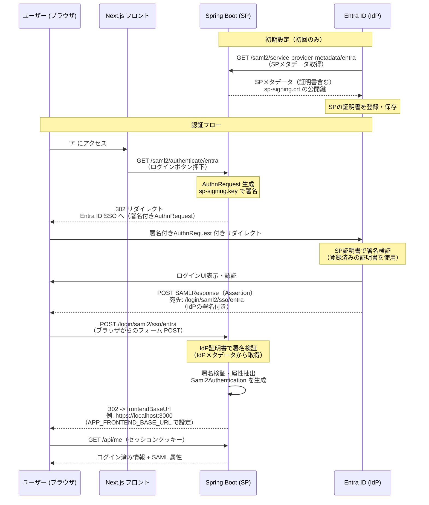

# SAML 認証シーケンス (Entra ID, SP Initiated)

Mermaid で現在の Spring Security + Next.js 構成のシーケンスをまとめました。

## フローの要点

### 初期設定（初回のみ）
- Entra ID が SP メタデータエンドポイント `https://localhost:8080/saml2/service-provider-metadata/entra` にアクセスして SP メタデータを取得します。
  - または、nginx経由で `https://localhost/saml2/service-provider-metadata/entra` にアクセスすることも可能です。
- SP メタデータには、SP の署名証明書（`sp-signing.crt` の公開鍵）が含まれています。
- Entra ID はこの証明書を登録・保存し、後続の署名検証に使用します。

### 認証フロー
- フロントエンド `/` の「Entra IDでログイン」リンクは SP Initiated で `/saml2/authenticate/entra` を叩き、Spring Security が AuthnRequest を生成します。
- **SP側の署名**: AuthnRequest は `sp-signing.key`（秘密鍵）を使用して署名されます（オプションですが、セキュリティのベストプラクティスとして推奨）。
  - 署名鍵は `SecurityConfig` の `RelyingPartyRegistrationRepository` で `signingX509Credentials` として設定されています。
- 署名付き AuthnRequest が Entra ID にリダイレクトされます。
- **IdP側の署名検証**: Entra ID は登録済みの SP 証明書（`sp-signing.crt` の公開鍵）を使用して AuthnRequest の署名を検証します。
- Entra ID で認証後、SAMLResponse は ACS エンドポイント `https://localhost:8080/login/saml2/sso/entra` に POST され、IdP の署名が付与されます。
  - nginx経由の場合は `https://localhost/login/saml2/sso/entra` に POST されます。
- **SP側の署名検証**: `SecurityFilterChain` の SAML フィルタで、IdP メタデータから取得した IdP の証明書を使用して SAMLResponse の署名を検証し、ログイン処理を行います（`Saml2AuthenticatedPrincipal`）。
- 成功時は `SecurityConfig` の `defaultSuccessUrl(frontendBaseUrl, true)` に従い、`APP_FRONTEND_BASE_URL` 環境変数で指定されたURL（デフォルト: `http://localhost:3000`、docker-compose.yml では `https://frontend:3000`）へリダイレクト。セッションは `HttpSessionSecurityContextRepository` で保持されます。
- フロントは同一オリジン/ポートのクッキーを付けて `/api/me` を呼び、SAML 属性や権限を確認できます。

### 署名鍵について
- **SP側の署名鍵**: `sp-signing.key`（秘密鍵）と `sp-signing.crt`（証明書）は `backend/src/main/resources/saml/` に配置されます。
- 秘密鍵（`sp-signing.key`）は絶対にコミットしないでください（`.gitignore` で除外済み）。
- 証明書（`sp-signing.crt`）は SP メタデータに含まれ、Entra ID に公開されます。
- 署名鍵を変更した場合は、新しい SP メタデータを Entra ID にアップロードする必要があります。

### 環境変数とデフォルト値
- **`SAML_ENTITY_ID`**: SP エンティティ ID（デフォルト: `https://localhost/saml2/service-provider-metadata/entra` または `http://localhost:8080/saml2/service-provider-metadata/entra`）
- **`APP_FRONTEND_BASE_URL`**: SAML 認証成功時のリダイレクト先（デフォルト: `http://localhost:3000`、docker-compose.yml では `https://frontend:3000`）
- **`SAML_IDP_METADATA_URI`**: Entra ID のメタデータ URL（必須、`SAML_ENABLED=true` の場合）
- **`SAML_ENABLED`**: SAML 認証を有効にするか（デフォルト: `false`）

### 注意事項
- 本プロジェクトでは nginx をリバースプロキシとして使用し、HTTPS（443ポート）でアクセスします。
- バックエンドは `X-Forwarded-Proto: https` ヘッダーを受け取り、HTTPSとして認識されます。
- 直接バックエンドにアクセスする場合は `https://localhost:8080` を使用します。
