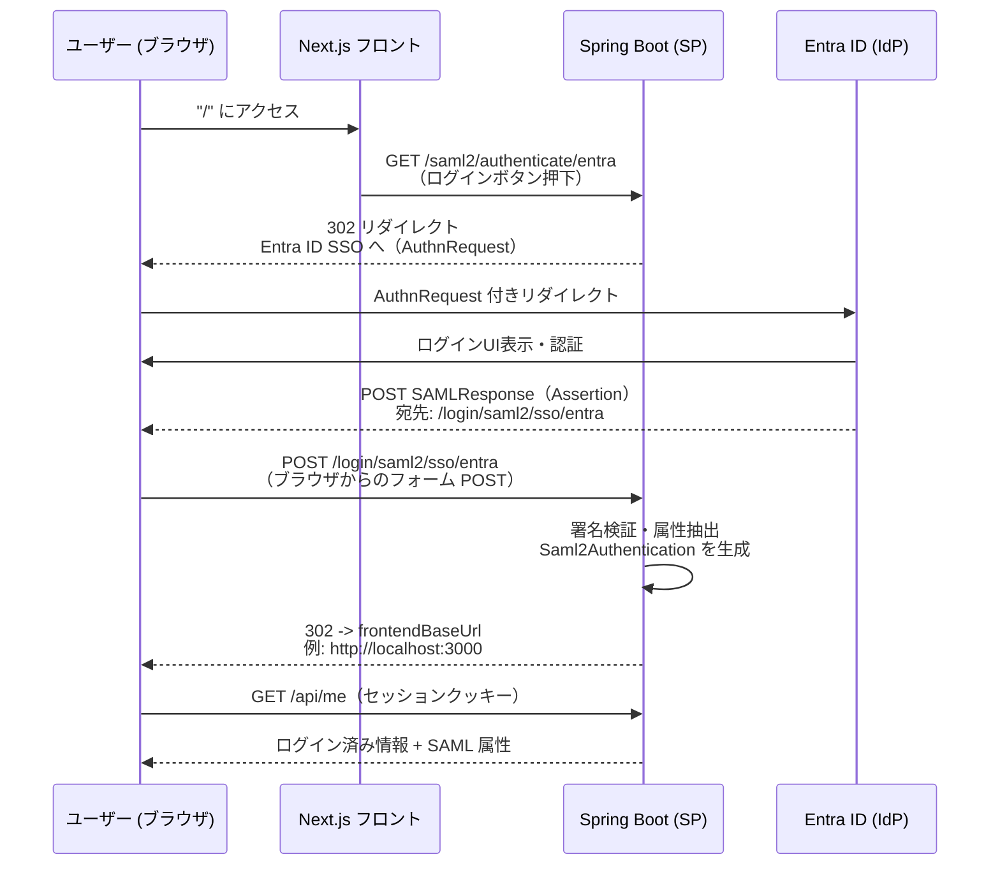

# SAML 認証シーケンス (Entra ID, SP Initiated)

Mermaid で現在の Spring Security + Next.js 構成のシーケンスをまとめました。

## フローの要点
- フロントエンド `/` の「Entra IDでログイン」リンクは SP Initiated で `/saml2/authenticate/entra` を叩き、Spring Security が AuthnRequest を発行して Entra ID にリダイレクトします。
- Entra ID で認証後、SAMLResponse は ACS エンドポイント `/login/saml2/sso/entra` に POST され、`SecurityFilterChain` の SAML フィルタで検証・ログインします（`Saml2AuthenticatedPrincipal`）。
- 成功時は `SecurityConfig` の `defaultSuccessUrl(frontendBaseUrl, true)` に従い、`APP_FRONTEND_BASE_URL`（既定 `http://localhost:3000`）へリダイレクト。セッションは `HttpSessionSecurityContextRepository` で保持されます。
- フロントは同一オリジン/ポートのクッキーを付けて `/api/me` を呼び、SAML 属性や権限を確認できます。
